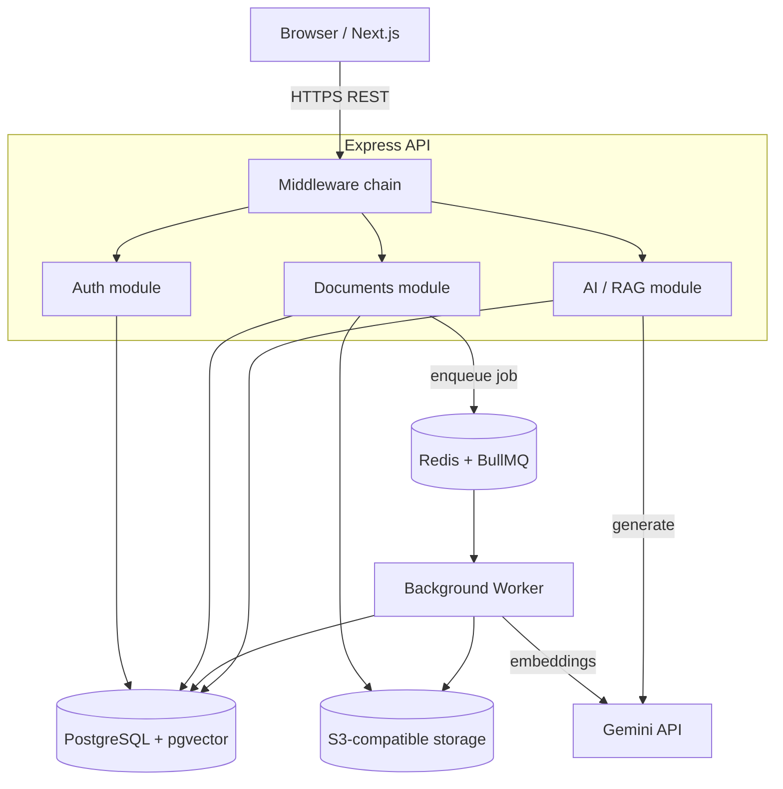
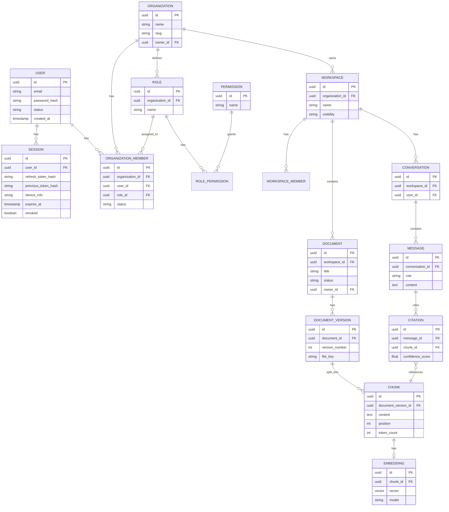
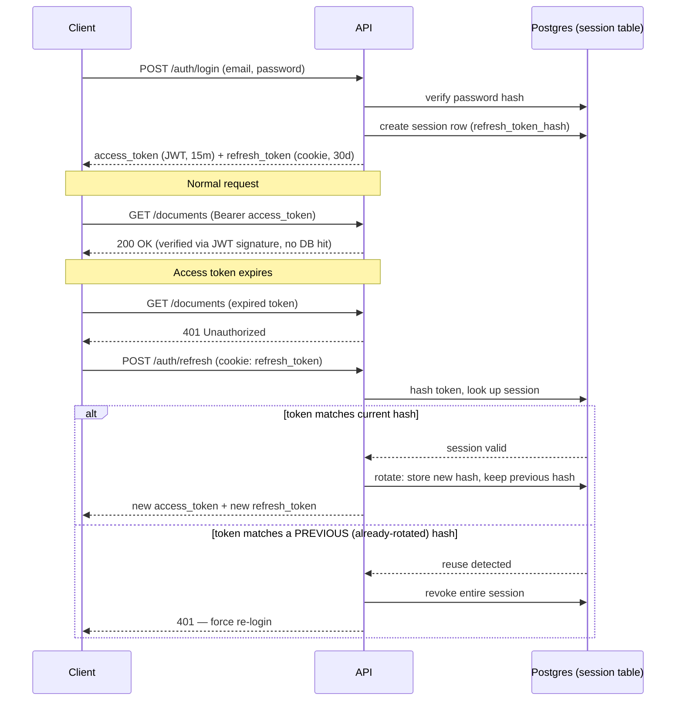
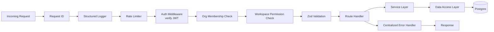
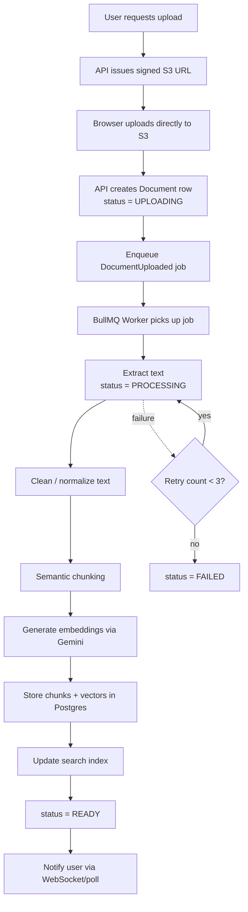
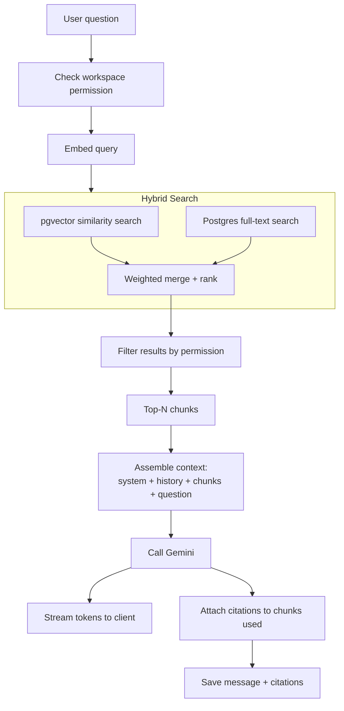

# Atlas — Architecture Diagrams (MVP Scope)

Scope: Phase 0–3 (foundation, auth, knowledge ingestion, RAG chat). Update these as you build — they should reflect what the code actually does, not the aspirational doc.

---

## 1. System Overview

---

## 2. Data Model — ER Diagram (MVP tables)

---

## 3. Auth Flow — Login, Refresh, Rotation, Reuse Detection

---

## 4. Request Lifecycle — Middleware Chain

---

## 5. Document Ingestion Pipeline

---

## 6. RAG Retrieval & Chat Flow

---

## How to keep these useful

- Store this file at `docs/architecture/diagrams.md` in the repo.
- Update a diagram **in the same PR** that changes the behavior it depicts — treat it like a test that can go stale.
- When you reach the Agents and Workflow slices, add new diagrams rather than overloading these.
- GitHub renders Mermaid natively in `.md` files, so this works as-is in your repo without any extra tooling.